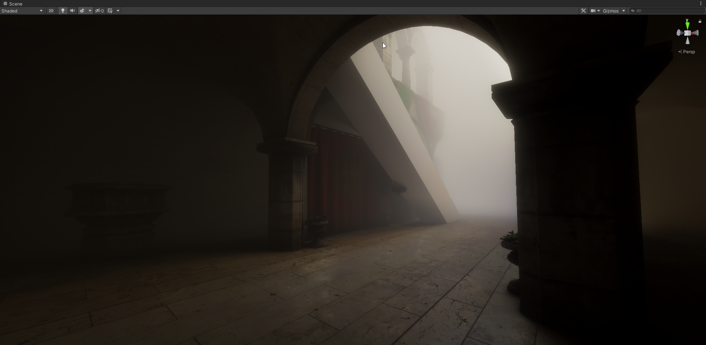
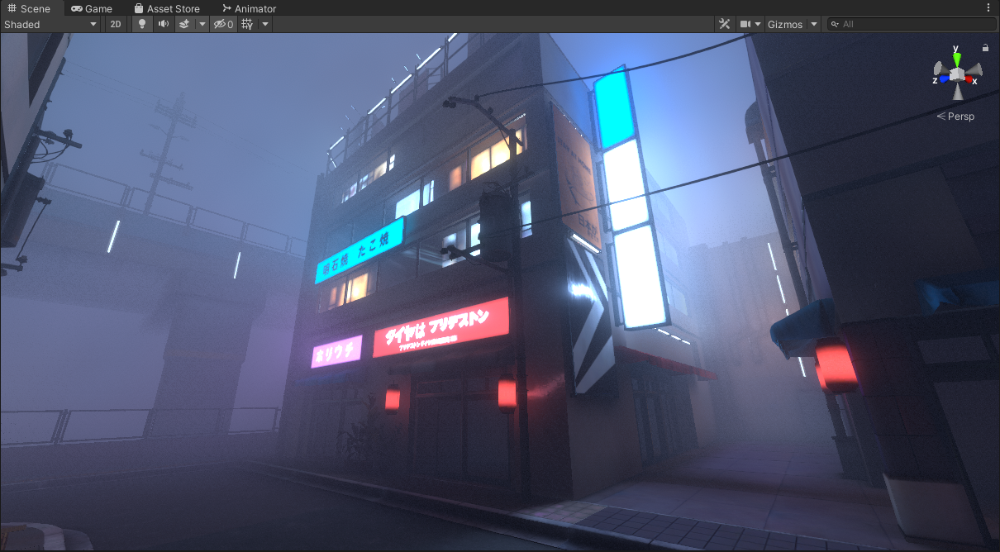

# Unity Baked Volumetrics
A **work in progress** graphics solution for completely baked volumetric lighting, meant to be very lightweight and inexpensive for VR. 

***More details will be revealed but it's very much a work in progress...***

# Results

# Context

**NOTE: Constructed on the Built-In Rendering Pipeline.**

The general concept is the following...

You define a box volume within your scene. You set the voxel density for ths volume *(or you can set a custom resolution)*, and choose to either sample colors from the scene light probes, or a custom raytracer, or both. Each have their advantages and drawbacks, but from there you use that to generate a 3D texture that is saved into the disk. At runtime, we sample this 3D texture and raymarch through it against the scene depth buffer to get the desired effect.

There are 2 versions of this effect, one being a "scene" based solution, and the other being a proper post process version.

The scene based solution is for circumstances where you don't have the abillity to create custom post processing effects. Why the heck would this be the case? A good example of this scenario is VRChat where you can't make custom post processing effects, but you can still make shaders within the scene itself. Note that this shader requires that there is a camera rendering a camera depth texture. This works automatically for deferred rendering, but for forward rendering the camera depth texture flag must be enabled. *(QUICK HACK: if that cant be done, another wierd quirk of the post processing stack is that you can enable ambient occlusion which automatically sets off the camera depth texture generation flag and therefore allows this effect to work.)*

The post processing based version is a work in progress currently, and is meant to be the proper implementation of this effect. It also allows me to leverage more techniques to make the effect way more efficent and lightweight at runtime. It works currently... but there is alot more I want to do to it.

*Will be elaborated on but yes this has been tested and works on Oculus/Meta Quest 2.*

# TODO
1. POST PROCESSING - Adding interleaved rendering to save on performance.
2. POST PROCESSING - Adding temporal filtering and animated noise to accumulate samples and save on performance.
3. POST PROCESSING - Using a froxel to intersect multiple volumes in a scene, and raymarch only once (rather than raymarch for each volume in the scene which would be dumb).
4. OFFLINE VOLUME GENERATION - Improve the raytraced volume speed by multithreading.
5. OFFLINE VOLUME GENERATION - Create a custom pathtraced/raytraced solution that voxelizes the scene within the volume and traces against it rather than relying on scene light probes which can be low quality (Could also be potentially faster than the current CPU only implemntation of the raytracer?).
6. EDITOR - Previewing Voxels is really really slow at low density values.
