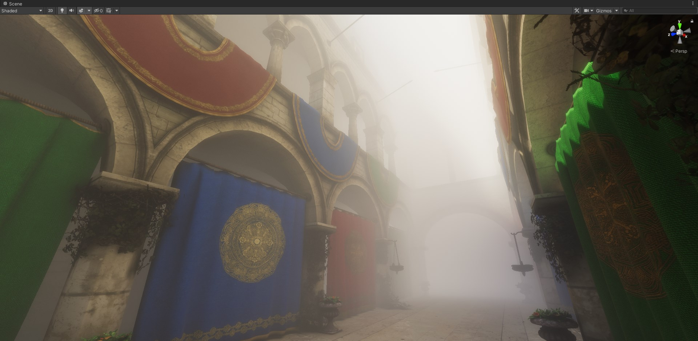
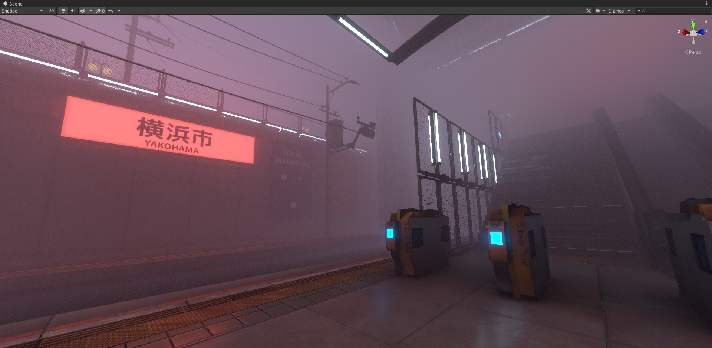

# Unity Baked Volumetrics
A **work in progress** graphics solution for completely baked volumetric lighting, meant to be very lightweight and inexpensive for VR. 

***More details will be revealed but it's very much a work in progress...***

# Results

# Features

Overview: This is basically lightmapping but for volumetric lighting and fog. 

- Completely baked volumetric lighting designed to be lightweight, and is baked completely offline in-editor.
- Volumetric lighting are sampled from either the scene light probes, or a custom CPU raytacer (or a voxelized GPU raytracer which is in the works). 
- Different density types for the fog. Constant, Luminance Based, or Height Based.
- Adjustments can be applied to tweak the look of the generated volume, along with a 3D Gaussian blur can be applied to improve the quality of the bake.
- There is a non post process scene based version, and a post process version.

**NOTE: Constructed on the Built-In Rendering Pipeline.**

# More Context

The general concept is the following...

You define a box volume within your scene. You set the voxel density for ths volume *(or you can set a custom resolution)*, and choose to either sample colors from the scene light probes, or a custom raytracer, or both. Each have their advantages and drawbacks, but from there you use that to generate a 3D texture that is saved into the disk. At runtime, we sample this 3D texture and raymarch through it against the scene depth buffer to get the desired effect.

There are 2 versions of this effect, one being a **Scene Based solution**, and a **Post Process** solution...

### Scene Based
The scene based solution is for circumstances where you don't have the abillity to create custom post processing effects. Why the heck would this be the case? A good example of this scenario is VRChat where you can't make custom post processing effects, but you can still make shaders within the scene itself. 

Note that this version requires that there is a camera rendering a camera depth texture. This works automatically for deferred rendering, but for forward rendering the camera depth texture flag must be enabled. If you don't have access to the main camera properties there are a couple of tricks you can do to enable the rendering of the depth texture in forward rendering.

***Camera Depth Texture Trick 1:*** If that cant be done, a quirk of the post processing stack is that you can enable ambient occlusion which automatically sets off the camera depth texture generation flag and therefore allows this effect to work. If your world doesn't need AO then I suggest putting the quality settings at its lowest so the cost of the AO effect is smaller. The intensity value also needs to be greater than 0 otherwise the effect won't be active.

***Camera Depth Texture Trick 2:***  Courtesy of [orels1](https://github.com/orels1), you can make unity enable depth pass without using AO (in case of VRC where you do not have access to adjusting Main Cam properties). All you need is a directional light with shadows enabled hitting some random empty layer - and unity will enable the depth pass for you.

### Post Processing
The post processing based version is a work in progress currently, and is meant to be the proper implementation of this effect. It also allows me to leverage more techniques to make the effect way more efficent and lightweight at runtime. It works currently... but there is alot more I want to do to it.

Currently right now it imitates the Scene Based solution, and it has a minor optimization implemented to where the volumetrics are rendered at half resolution and upsampled. However you can't stack multiple volumes, and this will be solved in later updates using a froxel solution.

*Will be elaborated on but yes this has been tested and works on Oculus/Meta Quest 2.*

# TODO
**POST PROCESSING:** Adding interleaved rendering to save on performance.
**POST PROCESSING:** Adding temporal filtering and animated noise to accumulate samples and save on performance.
**POST PROCESSING:** Using a froxel solution to intersect multiple volumes in a scene, so we can raymarch only once rather than raymarch for each volume in the scene which would be dumb. This also allows the abillity to have multiple volumes in the scene in an efficent way for the post processing solution.
**OFFLINE VOLUME GENERATION:** Improve the cpu raytraced volume speed by multithreading.
**OFFLINE VOLUME GENERATION:** Create a custom pathtraced/raytraced solution that voxelizes the scene within the volume and traces against it rather than relying on scene light probes which can be low quality (Could also be potentially faster than the current CPU only implemntation of the raytracer?).
**EDITOR:** Previewing Voxels is really really slow at low density values, need to come up with a different way to preview the different voxels.
**EDITOR:** Add a context menu item in the scene hiearchy to create a volume.
